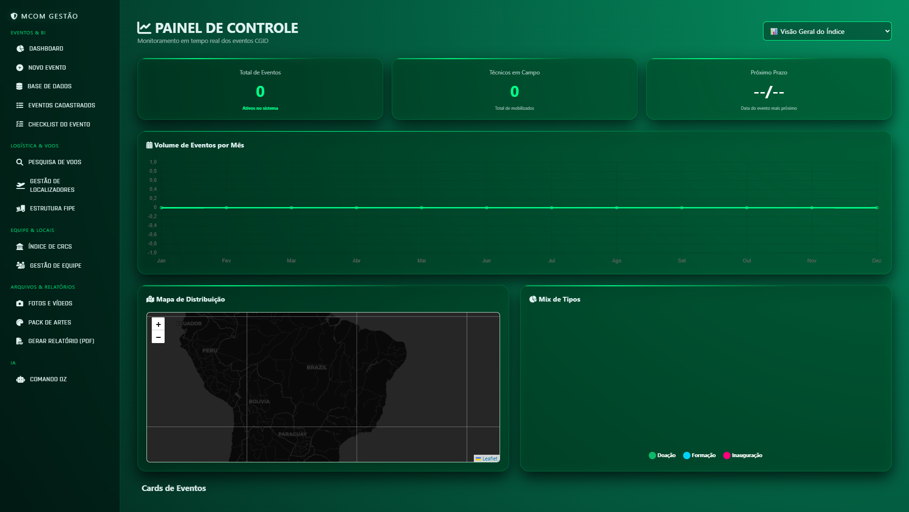
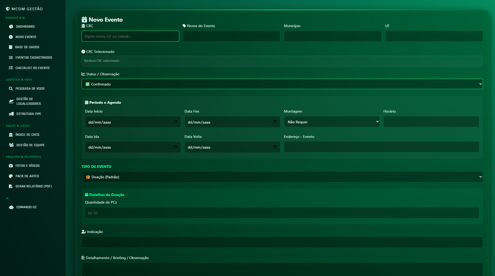

# Calendário MCom - Sistema de Gestão de Viagens e Eventos


## Sobre o Projeto

Sistema web desenvolvido para a Coordenação Geral de Inclusão Digital com o objetivo de centralizar o gerenciamento de viagens, eventos, reuniões e compromissos institucionais da equipe.

O projeto surgiu da necessidade de consolidar informações que anteriormente estavam dispersas em planilhas, mensagens e documentos, permitindo uma visão unificada da agenda institucional. A plataforma possibilita o cadastro completo de eventos, acompanhamento dos participantes e geração automatizada de resumos individuais para cada atividade registrada.

Além de facilitar o planejamento das ações da equipe, o sistema contribui para a organização administrativa, melhora a comunicação interna e reduz o tempo gasto na elaboração manual de relatórios e acompanhamentos.

---

## Screenshots

### Dashboard Principal



### Cadastro de Evento



---

## Funcionalidades

* Cadastro completo de viagens e eventos
* Registro de informações institucionais e logísticas
* Controle de participantes confirmados
* Controle de participantes ausentes
* Organização centralizada da agenda da equipe
* Consulta rápida de compromissos cadastrados
* Atualização dinâmica das informações
* Integração com API para persistência de dados
* Geração automática de resumos individualizados
* Interface intuitiva e responsiva
* Centralização das informações em ambiente único

---

## Tecnologias Utilizadas

| Tecnologia | Descrição                                                 |
| ---------- | --------------------------------------------------------- |
| HTML5      | Estruturação semântica da aplicação                       |
| CSS3       | Estilização, layout e responsividade                      |
| JavaScript | Regras de negócio, manipulação dos dados e interatividade |
| API REST   | Persistência e sincronização das informações              |
| GitHub API | Armazenamento e atualização dos registros do sistema      |

---

## Estrutura do Projeto

* calendario-mcom/
* |
* |--- src/              # Código-fonte principal
* |--- docs/             # Screenshots e documentação
* |--- assets/           # Recursos visuais
* |--- api/              # Integrações e persistência de dados
* |--- README.md

---

## Módulos do Sistema

### Gestão de Eventos

Permite cadastrar compromissos institucionais contendo informações como data, local, descrição e participantes envolvidos.

### Gestão de Participantes

Realiza o controle dos membros confirmados e ausentes em cada atividade cadastrada.

### Agenda Centralizada

Disponibiliza uma visão consolidada dos compromissos da equipe, facilitando o planejamento e acompanhamento das ações.

### Gerador de Resumos

Robô responsável pela criação automática de resumos individualizados para cada evento, reduzindo atividades manuais e padronizando registros.

---

## Resultados Obtidos

* Centralização das informações da equipe
* Redução do uso de controles paralelos
* Maior organização das viagens e eventos institucionais
* Agilidade na consulta de compromissos
* Padronização dos registros administrativos
* Diminuição do trabalho manual na elaboração de resumos
* Melhoria no acompanhamento da participação da equipe

---

## Como Executar

1. Clone o repositório:

   ```bash
   git clone https://github.com/ProfissionalJV/calendario_mcom.git
   ```

2. Configure a integração com a API conforme a documentação do projeto

3. Abra a aplicação em ambiente local ou servidor web

4. Utilize a interface para cadastrar e gerenciar eventos

---

## Observação

As versões utilizadas em ambiente institucional podem conter integrações, fluxos e informações não disponibilizados publicamente.

Os materiais apresentados neste repositório foram adaptados exclusivamente para fins de documentação, demonstração técnica e portfólio.

---

## Autor

**Victor Arsego Lêla**

* Desenvolvedor Web e Automatizador de Processos
* Engenharia da Computação - CEUB
* Gestão Pública - Estácio
* - [LinkedIn](https://www.linkedin.com/in/vltech/)
---

Projeto desenvolvido para apoiar a gestão de viagens, eventos e atividades institucionais da Coordenação Geral de Inclusão Digital.

---
